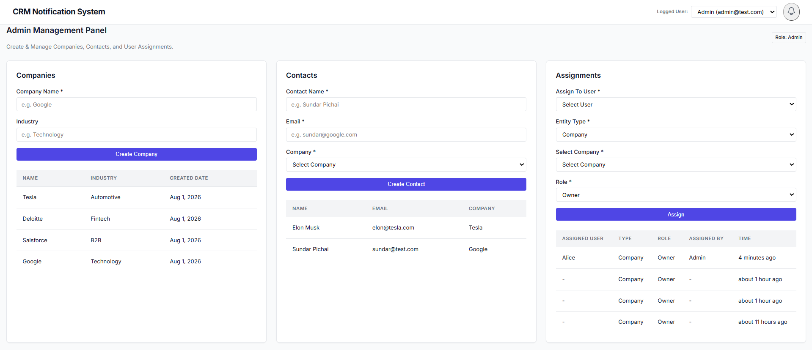
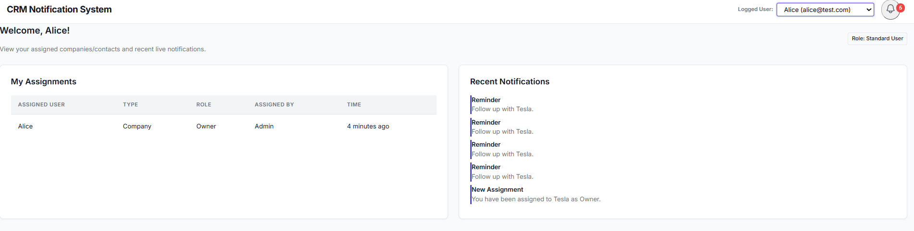
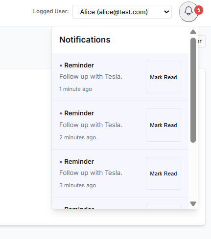

# CRM Notification System

A full-stack CRM application with real-time notifications built using the MERN stack. The application allows administrators to manage companies, contacts, and role-based assignments while delivering instant notifications to assigned users using Socket.IO.

---

## Features

### CRM Management

- Create and manage Companies
- Create and manage Contacts
- Link Contacts to Companies
- Assign Companies or Contacts to Users
- Support multiple assignments per user

### Real-Time Notifications

- User-specific Socket.IO notifications
- Notifications are persisted in MongoDB
- Notification bell with unread count
- Toast notifications for live updates
- Mark notifications as read

### Background Notifications

- Background reminder notifications using `node-cron`
- Reminders are stored in MongoDB
- Live delivery through Socket.IO

### User Views

**Admin**

- Create Companies
- Create Contacts
- Create Assignments
- View CRM data

**Standard User**

- View assigned entities
- Receive live notifications
- View notification history
- Mark notifications as read

---
## Screenshots

### Admin Dashboard



### User Dashboard



### Live Notification




## Tech Stack

### Frontend

- React (Vite)
- Axios
- React Router
- Socket.IO Client
- Heroicons
- date-fns

### Backend

- Node.js
- Express.js
- MongoDB
- Mongoose
- Socket.IO
- node-cron

---

## Project Structure

```
crm-notification-system/
│
├── client/
│   ├── src/
│   │   ├── components/
│   │   ├── services/
│   │   ├── socket/
│   │   └── App.jsx
│
├── server/
│   ├── src/
│   │   ├── config/
│   │   ├── controllers/
│   │   ├── models/
│   │   ├── routes/
│   │   ├── services/
│   │   ├── socket/
│   │   ├── cron/
│   │   └── seed/
│   └── server.js
```

---

## Database Models

### User

- name
- email
- isAdmin

### Company

- name
- industry

### Contact

- name
- email
- company

### Assignment

- user
- entityType
- entityId
- role
- assignedBy

### Notification

- user
- title
- message
- entityType
- entityId
- read

---

## Installation

### Clone Repository

```bash
git clone <repository-url>

cd crm-notification-system
```

---

### Backend Setup

```bash
cd server

npm install
```

Create `.env`

```env
PORT=5000

MONGO_URI=your_mongodb_connection_string

CLIENT_URL=http://localhost:5173
```

Seed sample users

```bash
npm run seed
```

Start backend

```bash
npm run dev
```

---

### Frontend Setup

```bash
cd client

npm install

npm run dev
```

---

## API Endpoints

### Users

```
GET /api/users
```

### Companies

```
GET /api/companies

POST /api/companies
```

### Contacts

```
GET /api/contacts

POST /api/contacts
```

### Assignments

```
GET /api/assignments

POST /api/assignments
```

### Notifications

```
GET /api/notifications/:userId

GET /api/notifications/unread/:userId

PATCH /api/notifications/:id/read
```

---

## Real-Time Notification Flow

```
Admin

↓

Assign Company / Contact

↓

Assignment Created

↓

Notification Saved

↓

Socket.IO Event

↓

Assigned User Receives Live Notification

↓

Notification Stored in MongoDB
```

---

## Background Process

A background cron job periodically creates reminder notifications for assigned users.

Flow:

```
node-cron

↓

Read Assignments

↓

Generate Reminder

↓

Save Notification

↓

Emit Socket.IO Event

↓

User Receives Reminder
```

---

## How to Test

### 1. Start Backend

```bash
cd server

npm run dev
```

### 2. Start Frontend

```bash
cd client

npm run dev
```

### 3. Seed Users

```bash
npm run seed
```

### 4. Open Application

Select **Admin** from the user dropdown.

### 5. Create Company

Example

```
Tesla

Automotive
```

### 6. Create Contact

```
Elon Musk

elon@test.com
```

### 7. Assign Company

Assign Tesla to Alice as Owner.

### 8. Switch User

Change active user to Alice.

Expected:

- Live toast notification
- Notification bell updates
- Notification persists after refresh

### 9. Mark Notification Read

Unread count decreases immediately.

### 10. Wait for Background Reminder

The scheduled reminder notification appears automatically.

---

## Assumptions

- Authentication is intentionally omitted.
- User switching simulates login for demonstration purposes.
- Multiple assignments for the same user are allowed.
- Notifications are persisted in MongoDB.
- Socket.IO rooms ensure notifications are delivered only to the intended user.

---

## Future Improvements

- JWT Authentication
- Role-Based Access Control (RBAC)
- Edit/Delete functionality
- Search & Filtering
- Pagination
- Email Notifications
- Push Notifications
- Audit Logs

---

## Author

**Krishan Malhotra**

Thapar Institute of Engineering & Technology